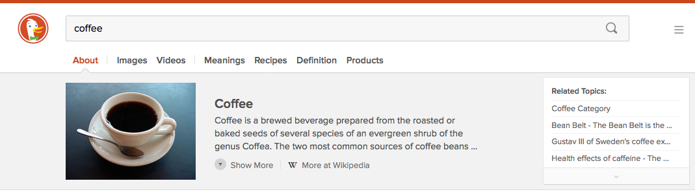
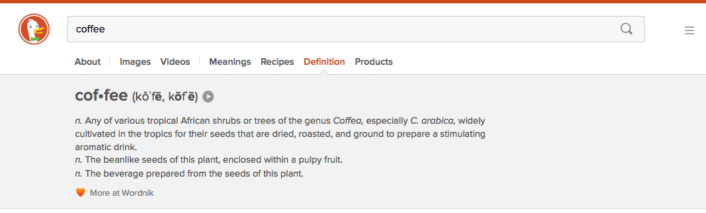
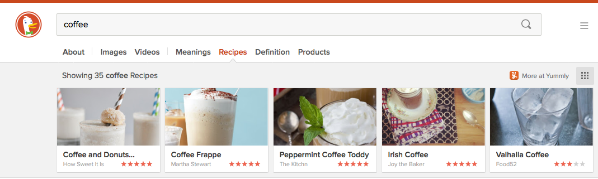
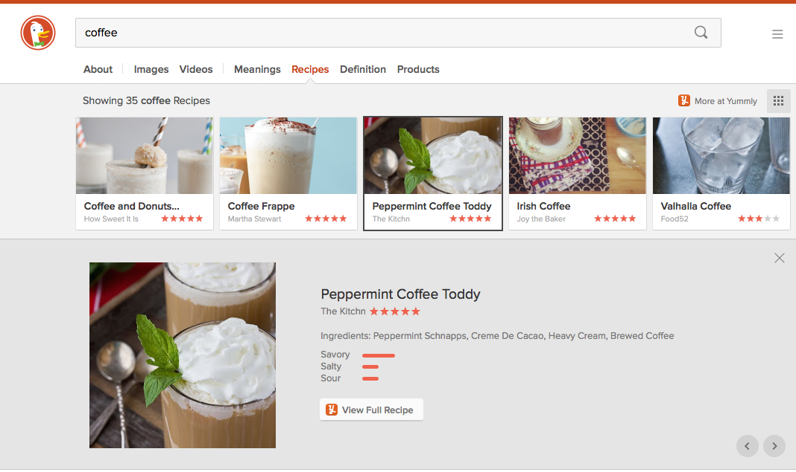
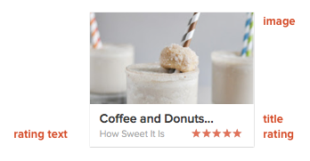
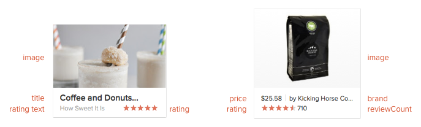

# What's New in the DuckDuckHack Platform

**May 2014**

The new verison of DuckDuckGo has launched into public beta!  This document highlights changes to the Instant Answer platform.

## Highlights

- AnswerBar: many Instant Answers can display on the page at once
- Wider: Instant Answers can fill the width of the page in certain cases
- New views for Instant Answers: Tile view with grid mode, Interactive maps, Image view
- New templates and layouts: Text, Info, Products with variations and feature flags
- Automated api result relevancy checking and data sorting

Most of the changes to instant answers apply only to the [Spice][Spice] instant answer type (external API),but these abilities will be brought soon to the [Goodies][Goodies] type.

## AnswerBar

The AnswerBar display instant answers in tabs. Because many IAs can load together, they need to play well together now. For example, they can't arbitrarily name CSS or helper functions arbitrary names as there is a chance of conflict.

<!--

-->

In this example:

- About: Wikipedia or [Fathead][Fathead] result
- Images and Video results
- Meanings: disambiguation (*meanings of 'coffee'*)
- Recipes: a Spice Instant Answer
- Dictionary Definition: a Spice Instant Answer
- Products: an Spice instant answer

DuckDuckGo's internal processes determined the About, Images, Video, and Meanings results.

The others, Spice Instant Answers, individually define a query space with their [triggers][triggers]. In the above example Recipes, Dictionary and Products have already recieved data from their respective external APIs and have determined that the data is actually relevant to the user's query.

## Answers

Instant answers are of two fundamental types: single- and multi-item. Below is a single item, the dictionary definition Spice instant answer:

<!--

-->

This is a single item displayed using the detail template defined by the instant answer.

## Tile View

When an Instant Answer has multiple items, they are generally shown in the Tile View. It's very flexible, supports different tile size variations, grid mode, and interspersed detail view.

<!--

-->

Each *tile* is a container that displays an item rendered with a template defined by the instant answer.  The term *item* refers to the single unit of data as defined by the IA - in these examples, a definition or single recipe is an item.

The item can also be shown with its detail template:

<!--

-->

## Templates and Layouts

Templates and template groups define how items are displayed in different contexts - as single items, as tiles, as tile view detail, as mobile items.

Recipes, above, uses the products template group - a set of templates for displaying products and product-like information.

<!--

-->

These two tiles are both using variations of the DuckDuckGo built-in *products* template group, which is meant for displaying products and product-like items. Recipes, on the left, uses the 'simple' variation. Recipes are like products, except that they don't have a brand or a price.

## Data Mapping with normalize()

Because APIs define their data in their own ways, instant answers define a `normalize()` function that maps data to the field names required by a buit-in template. For example, the Yummly API used by Recipes returns an array of images called `imageUrlsBySize`, so Recipes sets `image` required by the products template group with one of these.

## Anatomy of an IA

[Spice]: https://github.com/duckduckgo/duckduckgo-documentation/blob/master/duckduckhack/spice/spice_overview.md
[Goodies]: https://github.com/duckduckgo/duckduckgo-documentation/blob/master/duckduckhack/goodie/goodie_overview.md
[Fathead]: https://github.com/duckduckgo/duckduckgo-documentation/blob/master/duckduckhack/fathead/fathead_overview.md
[triggers]:https://github.com/duckduckgo/duckduckgo-documentation/blob/master/duckduckhack/goodie/spice_triggers.md

