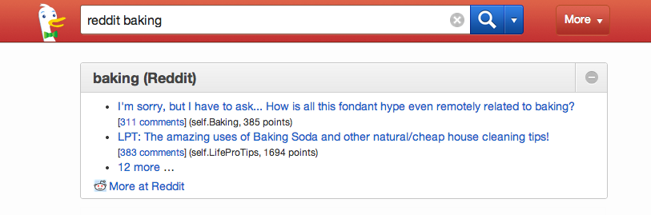
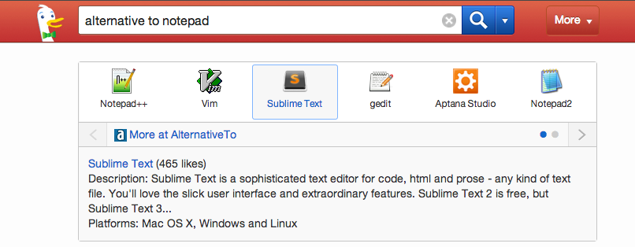
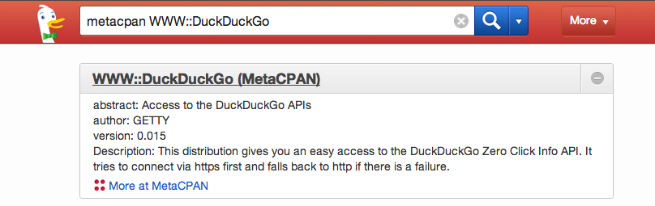
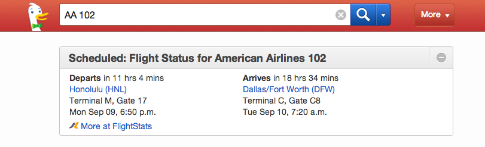

# Spice Templates Overview
There are several templates to choose from, each of which are best for displaying certain kinds of results and information

## List

### Use Case:
A list of results (eg. links) to display. Works best for bulleted/numbered lists.

### How it looks:


### How it works:
###### reddit_search.js [link](https://github.com/duckduckgo/zeroclickinfo-spice/blob/master/share/spice/reddit_search/reddit_search.js)
```javascript
Spice.render({
    data              : api_result.data.children,
    header1           : header,
    source_url        : source,
    source_name       : 'Reddit',
    spice_name        : 'reddit_search',
    template_frame    : 'list',
    template_options     : {
        items: api_result.data.children,
        show: 2,
        max: 14,
        template_item: 'reddit_search'
    },
    force_big_header  : true,
    force_space_after : true,
    force_no_fold : true
});
```


## Carousel

### Use Case:
A list of results to display, each of which has a unique image and title. Each item also has more information to be displayed once the carousel item is clicked.

### How it looks:


### How it works:
###### quixey.js [link](https://github.com/duckduckgo/zeroclickinfo-spice/blob/master/share/spice/quixey/quixey.js)
```javascript
Spice.render({
    data: api_result,
    source_name: 'Quixey',
    source_url: 'https://www.quixey.com/search?q=' + q,
    header1: api_result.q + ' (App Search)',
    force_big_header: true,
    more_logo: "quixey_logo.png",
    template_frame: "carousel",
    template_options: {
        template_item: "quixey",
        template_detail: "quixey_detail",
        items: relevants
    }
});
```


## Record

### Use Case:
Single result with various pieces of information, each of which has a unique name/title/descriptor.

### How it looks:


### How it works:
###### meta_cpan.js [link](https://github.com/duckduckgo/zeroclickinfo-spice/blob/master/share/spice/meta_cpan/meta_cpan.js)
```javascript
Spice.render({
    data             : api_response,
    header1          : query + " (MetaCPAN)",
    source_url       : 'https://metacpan.org/' + link,
    source_name      : 'MetaCPAN',
    template_normal  : 'meta_cpan',
    force_big_header : true,
    force_no_fold    : true
});
```


## Split Pane

### Use Case:
Single result that needs a vertically split layout (left & right panes) for your information.

### How it looks:


### How it works:
###### airlines.js [link](https://github.com/duckduckgo/zeroclickinfo-spice/blob/master/share/spice/meta_cpan/airlines.js)
```javascript

```
